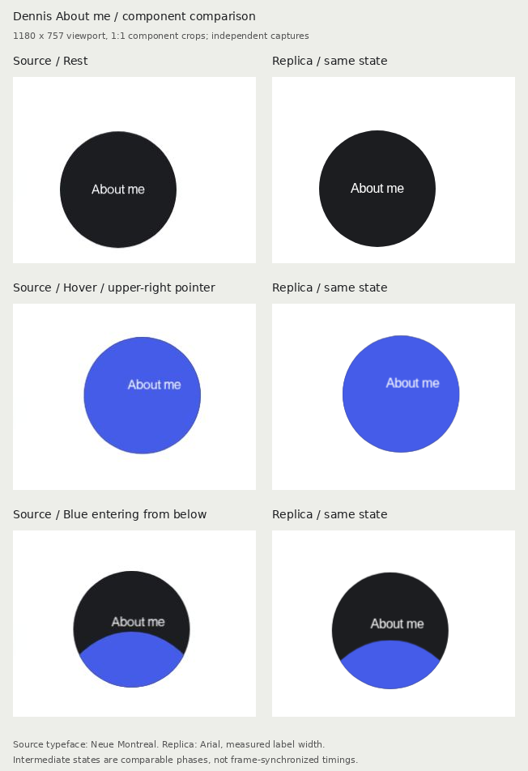

# Dennis / About me: first fidelity benchmark

Reference: https://dennissnellenberg.com/ (home → introductory section → About me)
Gallery route: `/ui-gallery/buttons/magnetic-fill/`
Observed: 2026-10-02. Desktop viewport: **1180 × 757 CSS px**.

This corrects the first rejected reference study. It is a **component trace for review**, not a declaration that the remaining 29 studies are faithful.

The crops retain 1:1 scale. Source and replica were captured separately at the same viewport, with the pointer moved from outside to the upper-right of the circle. The intermediate images compare the same phase; they are not claimed to have identical timestamps or an identical browser-input event stream.

## What was corrected

- Removed the invented green study board, dashed orbit, arrow, oversized 180px circle, and Selected toggle
- Replaced them with the observed white component context, plain About me label, moving link, measured dark/blue colors and responsive diameter
- Reproduced the blue ellipse entering **from below** and exiting **above**, rather than reversing downward
- Restored the stronger nested text movement: the label moves farther than the circle
- Separated pointer-follow easing from the oscillating return
- Kept commentary, controls, limitations and fallback explanations outside the demo
- Made all five motion categories reachable from one shared header on every UI Gallery route

## Measured versus inferred

| Property | Evidence | Replica |
| --- | --- | --- |
| Circle | Rendered DOM: 144 × 144 at 1180px viewport | 144 × 144 |
| Responsive size | Public CSS: clamp(9em, 12vw, 11em) | Same formula |
| Rest / blue | Public CSS and pixels: #1c1d20 / #455ce9 | Same colors |
| Fill geometry | Public CSS: 150% width, 200% height, ellipse, top -50%, left -25% | Same geometry |
| Fill endpoints | Rendered transforms: +218.88 → 0 on entry, 0 → -218.88 on exit | yPercent +76 → 0 → -76 |
| Circle / nested label strength | Rendered attributes: 100 / 50; observed transforms at exactly 2:1 | 100 / 50, label nested inside moving circle |
| Typeface | Source uses Neue Montreal at 16px; measured label width 65.78px | Arial at 16px with adjusted letter spacing; glyph shapes differ |
| Fill duration / curve | **Estimated** from transform samples, not source JS. Cubic-in/out fit: 613ms, input offset ~46ms, normalized RMS error ~0.012 | 600ms, power2.inOut |
| Tracking / return | **Estimated** from samples: approach asymptotically; return oscillations around 450ms apart with decay | 1500ms power4.out / 1500ms elastic.out(1, 0.3) |

The browser-control and capture path adds input/paint/screenshot latency. We recorded timestamp intervals and raw transforms instead of calling inferred values exact. Source JavaScript and licensed font files were not copied. The small source screenshots are limited to the component necessary for comparison.

## Reproduction boundary

This is the About me CTA in an isolated white stage. It does not clone the source's surrounding copy, photographs, page-level parallax or About-page transition.

About me remains an ordinary link to the source About page, opened in a new tab for the gallery. Keyboard focus, immediate touch feedback, disabling magnetism on touch / ≤540px, and reduced-motion behavior are explicit gallery fallbacks. They are not represented as source observations.

## Verification

- `npm run build`: passed (existing large-bundle warning remains)
- Metadata checks: passed
- Existing whole-gallery functional regression: **302/302**, zero axe findings. These checks do **not** establish visual fidelity
- Focused benchmark: **22/22** checks, including geometry/colors, strength ratio, fill direction, exit/entry interruption, replay/reset, link activation, focus, reduced motion, touch and narrow-screen overflow
- Shared category navigation: all **40** UI Gallery routes checked at 1440, 390 and 320px, including current category, counts, no-JS rendering, keyboard, legacy boundaries, Back/Forward and Swup

Run the focused benchmark with `node scripts/motion/verify-dennis-benchmark.mjs`. It starts its own Vite server and launches Playwright. Optional `UI_CHROMIUM_EXECUTABLE_PATH`, `UI_CHROMIUM_ARGS` and `UI_BENCHMARK_OUTPUT` configure the environment.

Raw source baseline and live samples are beside this file. The comparison was inspected after capture. The licensed typeface, source page transition, exact event timing, and user acceptance remain outside the passed checks.
