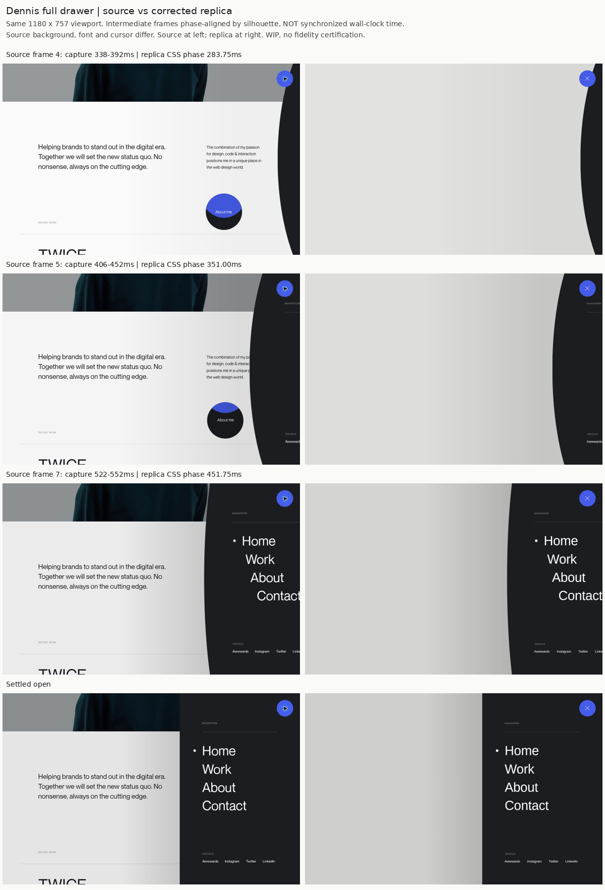

# Dennis の全高メニュー：修正した比較例

[原作](https://dennissnellenberg.com/)を2026-10-02に操作し、1180×757pxの表示DOM・公開CSS・途中フレームを比較しました。ユーザーレビュー前のWIPです。

- 右の全高パネル、曲がる先端、背景の暗転、4リンクの時差を再構成
- パネル幅477.34px、パネル800ms、曲線幅6vw→0を850ms、cubic-bezier(.7,0,.2,1)は原作の表示値
- 途中の曲線が広がりすぎる原因だった楕円の位置とクリッピングを修正
- 同じCSS進行度で曲線の縁を比較すると、修正前15〜32pxのずれが、対象フレームで通常1〜2pxへ縮小。全体の類似度スコアではありません
- 52項目の操作確認を実施。操作確認と原作への一致は別の評価です

## 残る違い

Dennis Sansの代わりにシステム書体を使用しているため、字形・太さ・文字幅が違います。元のページの写真・ロゴ・スクロール動作は含まず、メニュー単体をデモ枠に収めています。磁力の戻り方など一部は推定です。スマートフォンは安全な操作と表示を確認していますが、原作実機映像との一致は未確認です。

原作の撮影時刻と修正版の描画時刻は同期していません。比較画像はパネル位置から途中の進行度を合わせたものです。

- [操作確認結果](verification.json)
- [原作の測定値](measurements.json)
- デモ: `/ui-gallery/buttons/menu-icon-morph/`
