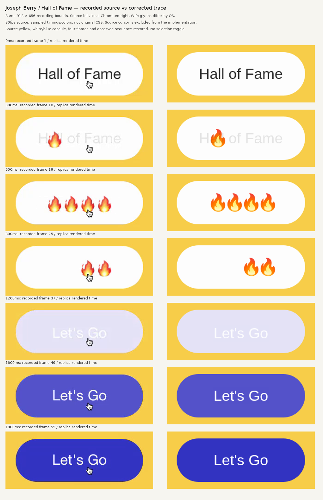

# Joseph Berry のボタン：修正した比較例

[公式の記録映像](https://www.awwwards.com/inspiration/joseph-berry-masterclass-hover-button-animation)の74フレームを計測し、白いカプセル、四つの炎、青い背景と文字の順序を作り直しました。ユーザーレビュー前のWIPです。

- 記録画面918×656pxで、外周約278×94px、文字約32px、黄色は計測値#f7cd49
- 元の文字は約500msで消え、炎は約200〜1000msの間に左から100msずつずれて表示・消失
- 最後の文字は下から上がりながら現れ、約1800msで青い#3233c1へ落ち着く
- 旧実装の星、独自の見出し、別の配色、850msで終わる順序、選択トグルは削除
- 21項目の操作確認に加え、時刻を合わせた途中状態を目視比較

## 残る違い

文字と炎はOSの書体・絵文字を使うため、特に炎の絵柄が異なります。Appleの絵文字画像はコピーしていません。色は圧縮映像の画素値で、元のCSSカラーと同じとは断定できません。元のCSS定数、入力イベントの正確な時刻、ホバーを外した時の挙動は不明です。

時間表は記録から読み取った状態の区間補間です。元のイージング関数を復元したものではありません。フォーカス・タップでの再生や、ホバー解除時の即時Resetはデモの補助操作です。

- [映像の計測値](measurements.json)
- [操作確認結果](verification.json)
- デモ: `/ui-gallery/buttons/icon-sequence/`
