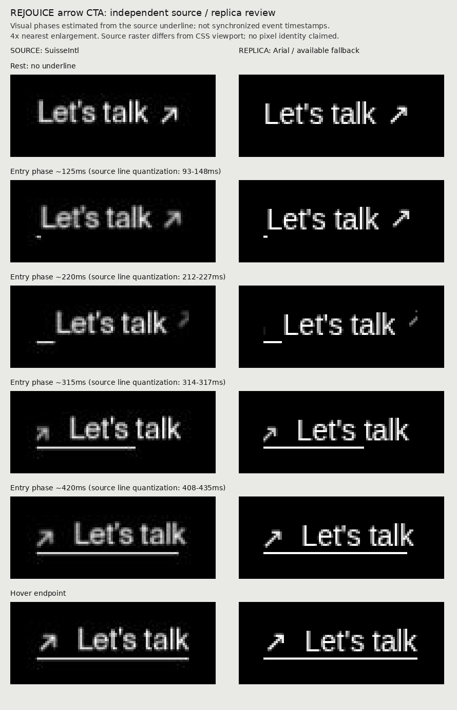

# REJOUICE ヘッダーリンク：修正した比較例

[原作](https://www.rejouice.com/)の「Let's talk」を2026-10-02に操作し、表示DOM・公開CSS・途中フレームを比較しました。ユーザーレビュー前のWIPです。

- 元の小さな白いテキストリンクへ戻し、大きな独自ボタンを削除
- 74.765625×15.953125px、14pxの文字、15pxの矢印、5pxの間隔を計測
- 文字の移動20px、矢印700ms cubic-bezier(.52,0,0,1)、下線600ms cubic-bezier(.85,0,.15,1)を反映
- 下線は初期状態では非表示。入る時も出る時も左を起点とする原作の上書き指定を反映
- 36項目の操作確認を2回実施。停止途中の反転、素早い出入り、キーボード、タッチ、動きを控える設定、破棄と履歴復帰を含みます

## 残る違い

SuisseIntlの代わりにArial系の書体を使用するため、字形・太さ・矢印の形は完全一致していません。原作の画像は圧縮・縮小され、修正版のPNGとは描画条件も違います。原作のページ全体は再現していません。

途中の画像は実際の下線の長さから進行度を推定しています。同期撮影ではなく、入力から描画までの遅延を実証した比較ではありません。キーボードの輪郭線、タッチの44px領域、別タブへの移動はデモ向けの補助です。

- [操作確認結果](verification.json)
- [原作の測定値](measurements.json)
- デモ: `/ui-gallery/buttons/arrow-swap/`
