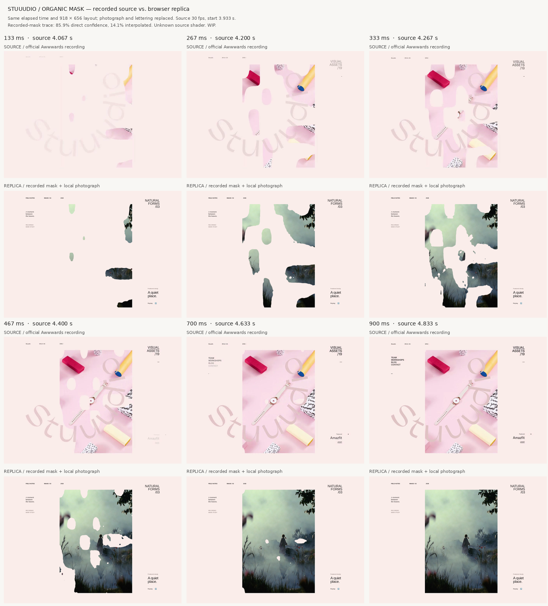

# Stuuudio の画像マスク：修正した比較例

[公式の記録映像](https://www.awwwards.com/inspiration/image-reveal-animation-mask-stuuudio)の3.933秒から始まる画像表示を、30fpsの連続フレームからトレースしました。ユーザーレビュー前のWIPです。

- 規則的な5×4の楕円を削除し、不規則な窓がつながり、最後に穴が消える実際の輪郭を記録
- 375×534pxの縦長画像、淡いピンクの背景、約900msの表示を反映
- 元の写真や文字は同梱せず、リポジトリ内の森の写真に輪郭を適用
- 85.9%は色を区別できる画素から計測し、14.1%は淡い写真・重なった文字のため周囲から補間
- 31項目の操作確認を実施。画像読込の競合、途中Reset、連続Replay、破棄、動きを控える設定、320/390/600px、素材失敗時の通常画像表示を含みます

## 残る違い

元のシェーダーやノイズ関数の復元ではなく、映像で見えた輪郭の時間変化を保存したトレースです。333〜400ms付近では、細い部分がつながる時刻や小さな穴の有無に補間由来の差が残っています。30fpsと映像圧縮による誤差もあります。

輪郭の比較はトレースに使った同じ映像から作った推定マスクとの比較です。独立した正解データや、全体の再現度スコアではありません。低コントラスト部分を除外した値を全画面の一致率とは解釈できません。

- [途中の輪郭](contours.png)
- [輪郭の計測結果と限界](contour-measurements.json)
- [操作確認結果](verification.json)
- デモ: `/ui-gallery/image-reveals/organic-mask/`

デモ内の「Trace notes」には時間マップ、外部素材、再利用時の必要ファイルを記載しています。
